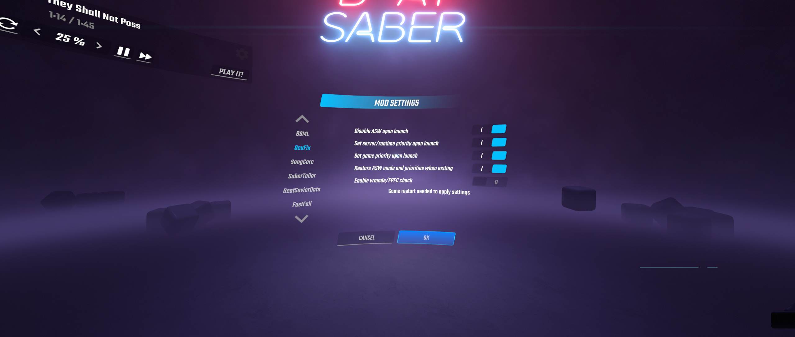

# 🔧 OcuFix
A BSIPA compatible mod that can automatically disable ASW (Asynchronous Spacewarp) and set game / Oculus service priority when you launch the game.

## Installation
Make sure that you have core mods installed with [ModAssistant](https://github.com/Assistant/ModAssistant) (BSIPA, BSML). Go to the [releases page](https://github.com/SamuelTulach/OcuFix/releases) and download the latest build (or build compatible with your Beat Saber version). Extract the zip file and move the DLL file into plugins folder located in Beat Saber install directory.

## Usage
There is not much configuration that you have to do. If you have installed Oculus software to default install location, you can just install the mod and stop caring about it. If you have installed it to a custom location, please change the Oculus Debug Tool CLI path in the plugin configuration (should be OcuFix.json in UserData). Make sure that it's a full path and that it properly escapes characters. Bellow you can see an example default config:

    {
    "DisableASW": true,
    "ServerPriority": true,
    "GamePriority": true,
    "DebugToolPath": "C:\\Program Files\\Oculus\\Support\\oculus-diagnostics\\OculusDebugToolCLI.exe"
    }

## Issues/constributing
If you find any issue or you have a suggestion, you can use GitHub issues. If you want to contribute, this repo is accepting pull requests.